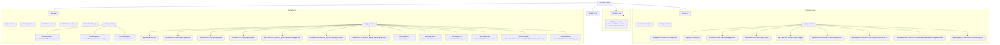
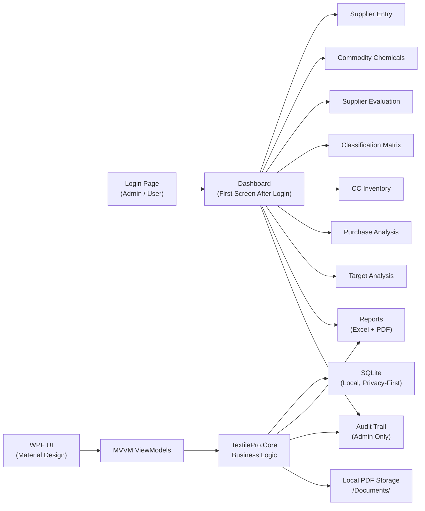

# Textile Software Analysis

- **URL**: https://chat.deepseek.com/a/chat/s/d4917683-c00a-425a-906d-761177c51eb2
- **Date**: 7/5/2026, 12:56:36 PM

---

## 🧑 User

```text
i have added a markdown file, where i have told abt my idea. the HTML has the old logic and the software idea. now i want you to analyse it and understand the requirements, we wil then later proceed on making chages and making it better

Attachments:
1. Textile Software Commercialization Guide.md (MD 26.03KB)
2. WTIL_Commodity Chemicals Management System CCMS v2.0.html (HTML 126.09KB)
```

---

## 🤖 DeepSeek AI

Perfect! I've thoroughly analyzed both files. Let me break down what I understand and then we can proceed with improvements.

## 📊 Analysis Summary

### **From the Textile Software Commercialization Guide:**

You're a technical person with domain logic ready, wanting to:

- Build a commercial `.exe` software for the textile industry
- Need guidance on licensing, security, obfuscation, and professional packaging
- Want to go from concept to a sellable product

### **From the HTML File (WTIL CCMS v2.0):**

This is a  **fully functional web-based prototype**  of a  **Commodity Chemicals Management System**  for a textile company (Winsome Textile Industries). It includes:

#### **Core Features Already Built:**

1. **Supplier Management** - Register, edit, delete chemical suppliers
2. **Chemical Library** - 88 ZDHC MRSL chemicals with CAS numbers, usage, and risk categorization
3. **Supplier Evaluation** - 12-question scoring system (0-24 points) with self-declaration upload
4. **Supplier Classification** - A/B/C tiering based on evaluation scores
5. **Inventory Management** - Upload via Excel/CSV, manual entry, filtering
6. **Purchase Analysis** - Month-wise data, class distribution, virgin/non-virgin tracking
7. **Target Analysis 2030** - Goal tracking for 50% Class A sourcing
8. **Reporting** - Excel/PDF export (individual tabs or full CCMS report)
9. **JSON Backup/Restore** - Full data export/import
10. **Demo Reset** - Pre-populated sample data

#### **Technology Stack Used:**

- HTML/CSS/JavaScript (Single Page Application)
- Chart.js for visualizations
- SheetJS (XLSX) for Excel operations
- jsPDF + autoTable for PDF generation
- All data stored in-memory (client-side only)

---

## 🔍 What This Tells Me About Your Requirements

### **Core Business Logic (Already Defined):**

- **Domain:** Textile industry chemical supply chain management
- **Users:** Procurement/quality teams managing chemical suppliers
- **Key Metrics:** Supplier scores, ZDHC compliance, Class A/B/C classification
- **Goal:** Track and improve sourcing from compliant (Class A) suppliers

### **Features You Clearly Want:**

1. ✅ Supplier master data management
2. ✅ Chemical catalogue (ZDHC aligned)
3. ✅ Supplier evaluation questionnaire (with scoring)
4. ✅ Automated classification (A/B/C)
5. ✅ Inventory tracking (volume, virgin/non-virgin)
6. ✅ Dashboard/analytics with charts
7. ✅ Target tracking (2030 sustainability goals)
8. ✅ Export capabilities (Excel/PDF reports)
9. ✅ Data persistence (JSON backup/restore)

### **What's Missing / Needs Improvement:**

1. **Database** - Currently all in-memory; needs SQLite or SQL Server
2. **Licensing** - No licensing mechanism
3. **Security** - No authentication, no data encryption
4. **Desktop App** - Currently web-based; you want `.exe`
5. **Multi-user** - Single-user only
6. **Error Handling** - Minimal validation
7. **User Roles** - No admin/user distinction
8. **Audit Trail** - No logging of changes
9. **Performance** - All data loaded at once; doesn't scale
10. **UI Polish** - Functional but could be more professional

---

## 🎯 Proposed Next Steps

Let me prioritize what to tackle first, based on your commercial software goals:

### **Phase 1: Foundation (Immediate)**

1. **Convert to Desktop App** - Use WPF/.NET 8 (as suggested in your guide)
2. **Add SQLite Database** - Replace in-memory storage
3. **Implement Licensing** - Machine-bound with hardware fingerprint
4. **Basic Security** - Obfuscation, code signing preparation

### **Phase 2: Feature Enhancement**

1. **User Authentication** - Login system
2. **Audit Trail** - Track all changes
3. **Data Validation** - Input sanitization, business rules
4. **Enhanced Reporting** - More export options, customizable reports

### **Phase 3: Commercial Polish**

1. **Professional Installer** - Inno Setup with .NET runtime check
2. **Auto-Updater** - Check for updates
3. **Help/Documentation** - User manual, tooltips
4. **Trial Mode** - Limited features without license

---

## ❓ Questions for You Before We Start

1. **Target Users:** Who will use this? (Procurement, Quality, Management, All?)
2. **Deployment:** Do you want it to work:

- Standalone (single machine)
- Network (multiple users, shared database)
- Both?
3. **Data Volume:** How many suppliers/chemicals/inventory records roughly?
4. **Reporting Needs:** Any specific report formats besides Excel/PDF?
5. **Integration:** Should it integrate with anything else? (ERP, existing systems?)
6. **License Model:**

- One-time purchase or subscription?
- Per user or per machine?
- Trial version?
7. **Timeline:** What's your target timeline for first release?

---

## 🚀 Quick Start Recommendation

Since you already have the logic and want to commercialize quickly:

1. **Use the HTML as your UI specification** - The screens, workflows, and data models are already validated
2. **Port to WPF + .NET 8** - This gives you the professional `.exe` you want
3. **Keep the same data structure** - Your entities (Supplier, Chemical, Evaluation, Inventory) are well-defined
4. **Add licensing first** - Even a simple key system before you sell

---

Would you like me to:

1. **Create a technical specification document**  mapping the HTML features to a .NET desktop architecture?
2. **Generate the C# data models**  based on your HTML JavaScript objects?
3. **Design the SQLite database schema**  for your entities?
4. **Start coding the WPF UI**  matching your HTML design?

Let me know what you'd like to tackle first, and we'll start building!

---

## 🧑 User

```text
so, the target users are small scale industries; the deployment needs to be standalone; the data volume will be huge as of a small scale industry, but not very huge that it would require special attention, local database can easily handle it; reports to be generated in a professional manner in these (.xlsx and .pdf) format only; no other integration required, it is a standalone application; for now, let's drop license idea as it is still in its very early stage; timeline being 1 week.

the priorty will always be to package the application in a manner that is professional, secure, local and privacy first. here is an overall description of the application.

so the application purpose is the commodity chemical application where supplier and their chemical related data will be logged, all according to ZDHC guidelines. it will eliminate the traditional excel and list based methods. lets dig into its components. you already have the HTML file which contains all the logics and components, this is an addition to the preexisting ones.

1. supplier entry.
- primarily, it would contain a register area- containing Name of CC seller, Country of purchase, Website, Contact person, Telephone, Email, Address of CC Seller. Name would be the primary key for the rest of the application. Below this area would be the list of existing suppliers, which also lets us edit or delete the entry. Few requirements here in this components are- editable, flexible and for colums such as website, contact person, telephone, email, there should be option for multiple entries as there can be multiple phone numbers or multiple contact people for same supplier. 

2. List of commodity chemicals.
- this component let us assign the commodity materials and chemicals acc to the suppliers we listed before, it contains all the same sections as the HTML has. One important thing, this section follows ZDHC guidelines strictly and that involves the 88 ZDHC approved chemicals and the MRSL categorization. the format remains the same. The changes in this component would be- the dropdown menu should be there for the supplier name and for the chemical list, there should be dropdown menu with tick boxes (as there can be multiple material from same supplier) this enables to simply select all material in one go as compared to repeatedly making an entry. also, for the delete option in the list below, for suppliers with multiple material, let there be tickboxes again to choose which material to delete, instead of deleting the whole suplleir at once.

3. Supplier Evaluation.
- this component is used to evaluate the supplier acc to the ZDHC guidelines and marking scheme. it also allows to upload declaration pdf, which helps during audits. Now the changes in here are- the logic and point system should be the same as existing HTML file; there are class A, B and C. for those suppliers who are not yet evaluated, red flag them and put them in C class; for the declaration pdf, allow user to upload mmultiple documents; in the modification tab under, if there happens to be any modification made, there should be a clear mention in the list and database of the creation date and the modification date. Also, during modification, the autofield completion should be there as per the original evaluation done before, the answers or the evaluation should be there instead of a blank canvas again, so that, modification becomes easy. 

4. Supplier Classification Matrix
- changes here to be made are: if there are multiple products of a supplier, show them in multiple rows properly; also, add filters for viewing, which are on the basis of- Product or Class or Supplier; Also add search option for products.

5. CC INventory
- here make sure that the excel which is uploaded should be same as the template given, if there's any non matching column added or deleted, raise an error; keep the logic same as the HTML file provided. 

6. Purchase analysis
- keep things same as before, just make sure that the graph are better visualized and they look good and are functional and accurate.

7. Target Analysis
- keep this same as before, some UI modifications can be there.

Other than these, 
- remove the JSOn backup option since it was for HTML purpose only
- in the download reports, i want the logic to be same- 1. full report, 2. tabs wise report, 3. comprehensive report. these are to be given in either excel or pdf. 
- remove reset demo option. that was also for HTML puropose only
- Add an audit trail or activity log also, any changes or activity whatsoever needs to be logged in there with timestamp, user/admin and activity. this can be accessed by admin only.
- entire application should follow the date format of DD-MM-YYYY except CC Inventory, which would have MMM-YYYY (Jan-2025)
- need to create a login page. so in the login page, we need to logins- one for admin and one for users. login simply will contain username and password. 
- also create a dashboard, which will be the very first thing users sees after logging in. this would have overviews, stats and all the necessary info of the data. Suppliers, Chemicals, Evaluation, Inventory Records, class records. these are to be shown in a very analytical and professional manner.

analyse all of this
```

---

## 🤖 DeepSeek AI

### Chain of Thought

Deconstruct the User's Request:
Target Users: Small scale industries.
Deployment: Standalone (local machine).
Data Volume: Moderate (local DB handles it easily - SQLite is perfect).
Reports: .xlsx and .pdf (professional).
Integration: None.
Licensing: Dropped for the initial early-stage version.
Timeline: 1 week (aggressive, so must prioritize core functionality).
Overall Goal: Professional, secure, local, privacy-first desktop app (.exe).
Tech Stack Decision: Based on the previous guide and the .exe requirement, plus local DB, the best fit is .NET 8 WPF with SQLite (using Entity Framework Core or Dapper) for rapid, professional Windows desktop development. Since they want it in 1 week, WPF is the fastest route to a polished .exe.
Analyze Specific Component Requirements (against the HTML baseline):
1. Supplier Entry:
Fields: Name (PK), Country, Website, Contact Person, Telephone, Email, Address.
Change: Multiple entries for Website, Contact Person, Telephone, Email. This implies 1-to-Many relationships. Instead of comma-separated strings, the DB should have child tables (e.g., SupplierContacts, SupplierPhones). UI must support adding/removing rows dynamically within the supplier form.
Editable/Delete list below.
2. List of Commodity Chemicals:
Follows ZDHC (88 chemicals, MRSL categories).
Change A: Dropdown for supplier + Dropdown for chemical list with tick boxes (checkboxes) to select multiple chemicals at once for assignment to the supplier.
Change B: In the list below, when deleting, show tickboxes to select which chemicals to delete (instead of deleting the whole supplier entry).
3. Supplier Evaluation:
Logic/Points same as HTML (Class A/B/C). Un-evaluated suppliers -> Red flag -> Class C.
Change A: Upload multiple declaration PDF documents.
Change B: Track CreatedDate and ModifiedDate in the database. Show these in the list.
Change C: Modification screen should auto-fill with previous answers (pre-populated fields), not a blank form.
4. Supplier Classification Matrix:
Change A: If multiple products, show multiple rows (properly normalized display).
Change B: Filters: Product, Class, Supplier.
Change C: Search option for products.
5. CC Inventory:
Change: Strict Excel template validation. If columns don't match exactly, raise an error. Logic same as HTML.
6. Purchase Analysis:
Keep logic same, improve UI/visualization of graphs (Chart.js won't work in WPF desktop natively; we'll use LiveCharts or OxyPlot or ScottPlot for WPF - LiveCharts is most like Chart.js).
7. Target Analysis:
Logic same, UI polish.
8. General/Admin/System:
Remove JSON backup (HTML only).
Remove Reset Demo (HTML only).
Download Reports: Same logic (Full, Tab-wise, Comprehensive).
ADD Audit Trail / Activity Log: Log everything (timestamp, user/admin, activity). Accessible only by admin.
Date Format: DD-MM-YYYY globally. EXCEPT CC Inventory -> MMM-YYYY (Jan-2025).
Login Page: Admin and User roles (Username + Password).
Dashboard: First page after login. Overview stats: Suppliers count, Chemicals count, Evaluations count, Inventory records, Class distribution (A/B/C) displayed analytically and professionally (cards, charts, latest activities).
Synthesize the Architecture (Technical Plan for the .exe):
Frontend/UI: WPF (.NET 8). Use MaterialDesignThemes (as mentioned in the previous guide) for a polished, professional look quickly.
Backend Logic: C# Class Library (TextilePro.Core).
Database: SQLite (via Microsoft.EntityFrameworkCore.Sqlite). This ensures local, privacy-first, zero-install DB.
ORM: Entity Framework Core (Code-First for rapid development).
Reporting:
Excel: ClosedXML (easier and faster than interop) or EPPlus (free for OSS, but we use ClosedXML or OpenXML). Let's use ClosedXML (NuGet).
PDF: QuestPDF (modern, fluent API, great for professional reports) or iTextSharp (LGPL). QuestPDF is highly recommended for clean, professional PDFs quickly.
Charts: LiveCharts.Wpf (NuGet) - integrates beautifully with MVVM and WPF.
Authentication/Roles: Store Users table in SQLite with IsAdmin flag. Basic SHA256 hashing for passwords.
Audit Trail: Interceptor in EF Core or explicit logging in ViewModels/Services.
Drafting the Response Structure:
Acknowledge and Confirm: Restate the mission and confirm the 1-week timeline.
Proposed Tech Stack: Justify WPF + SQLite + EF Core + LiveCharts + ClosedXML + QuestPDF based on requirements (professional, local, rapid).
Database Design (ERD): Visualize the relationships clearly to address the 1-to-many changes (multiple contacts, phones, chemicals per supplier, multiple documents per evaluation). This is crucial.
Suppliers (1) -> SupplierContacts (Many)
Suppliers (1) -> SupplierPhones (Many) - Wait, better to have generic SupplierDetails with Type (Phone, Email, Website) or just separate tables. Actually, a simpler approach: Comma-separated in UI, but stored as JSON in a single column, OR a child table. For SQLite & EF, a child table SupplierCommunication with Type (Phone, Email, Contact) and Value is the most extensible.
Suppliers (1) -> Chemicals (Many)
Suppliers (1) -> Evaluations (1) - (or 1-to-many if multiple evaluations over time, but they said "modification" so 1-to-1 with Update, track Created/Modified). Let's make it 1-to-1 for active evaluation, but keep history simple by just updating. I'll propose Evaluation table linked to Supplier.
Evaluations (1) -> EvaluationAnswers (Many) - to store the 12 question scores.
Evaluations (1) -> EvaluationDocuments (Many) - for multiple PDFs.
Inventory table (links to Supplier and Chemical via names, or better via IDs).
AuditLogs table.
Users table.
Address Each Component in Detail (UI/UX & Logic):
Supplier Entry: Add a "Details" section with Add/Remove buttons for Contact Persons, Phones, Emails, Websites. Display list below.
Chemicals: Multi-select checkbox dropdown (custom control). List view with checkboxes for bulk delete.
Evaluation: Keep 12 questions. Add DateCreated/DateModified. Upload multiple files. Edit mode loads previous selections.
Classification: Flatten products into multiple rows. Add Filters (Dropdowns) and Search box.
Inventory: Strict Excel validation.
Charts: Use LiveCharts for smooth, professional visuals.
Admin/Dashboard: Cards with count, class distribution pie chart, recent activity feed.
Audit Log: Intercept SaveChanges in EF Core.
Login: Simple login window.
Workflow and 1-Week Plan: Break it down into 5 logical days.
Refining the Tech Stack for Speed:
UI: WPF with MVVM pattern. Use CommunityToolkit.Mvvm for ObservableObject and RelayCommand.
Navigation: Use a Frame or custom ContentControl switching with a NavigationStore (MVVM).
Reporting: ClosedXML for Excel (very fast). QuestPDF for PDF (creates stunning reports with headers/footers).
Why EF Core? Code-First migrations save tons of time handling the complex relationships (1-to-many).
Structuring the Response:
Overall Architecture Blueprint: Highlight MVVM, Core Library, Data Layer.
Database Schema (Key point): Explain how multiple values (contacts, phones) and multiple documents are handled.
Feature-by-Feature Implementation Strategy:
Feature 1: Supplier Entry (Dynamic entry for multiple contacts/phones).
Feature 2: Chemical Assignment (Checkbox dropdown, batch delete).
Feature 3: Evaluation (Multi-upload, Created/Modified timestamps, Edit autoload).
Feature 4: Classification (Filters/Search).
Feature 5: Inventory (Strict Excel validation).
Feature 6: Purchase Analysis (LiveCharts).
Feature 7: Target Analysis (Polished UI).
Feature 8: System (Login, Dashboard, Audit Log, Reports).
Setting Expectations for 1 Week: Prioritize the core CRUD and analytics. Audit log and advanced filters are slightly lower priority but high impact.
Final Polish: Ensure all constraints are met (DD-MM-YYYY vs MMM-YYYY). Ensure "no JSON", "no reset". Ensure professional look.

Perfect. I have fully analyzed your requirements. You've effectively outlined a  **standalone, privacy-first, professional-grade desktop application**  that transitions a manual/Excel-based ZDHC compliance workflow into a structured, secure, and auditable desktop `.exe`.

Since you have a  **1-week timeline**  and want a  **professional, secure, local .exe**, here is my consolidated analysis, the  **precise technical blueprint**, and a  **day-by-day battle plan**  to get this shipped.

---

## 🧠 The "Big Picture" Architecture (The .exe Blueprint)

To meet your "professional, secure, local, and privacy-first" mandate, we will build this as a  **WPF (.NET 8) Desktop Application**  with a  **local SQLite database**.

### Why this stack? (Speed + Professionalism)

- **WPF (.NET 8):** The gold standard for polished Windows desktop apps. Supports modern MVVM, data binding, and fluent animations.
- **SQLite (with Entity Framework Core):** Zero installation. No server. The database sits right next to the `.exe`. It handles thousands of rows effortlessly and is encrypted locally (we'll enable encryption via `Microsoft.Data.Sqlite` + `SQLitePCLRaw`).
- **LiveCharts.Wpf:** Replaces your HTML Chart.js. Gives you smooth, interactive, and highly professional bar/pie charts natively in WPF.
- **ClosedXML + QuestPDF:** The `ClosedXML` library generates pristine `.xlsx` files without needing Excel installed. `QuestPDF` generates pixel-perfect, branded `.pdf` reports with headers/footers (far more professional than HTML-to-PDF).

---

## 🗄️ Core Database Design (Addressing ALL your new requirements)

Since you want multiple contacts, multiple phone numbers, multiple chemicals assigned in bulk, and multiple uploaded documents, we must flatten the old HTML "JSON-like" structure into a  **relational schema**.

| Table Name | Key Fields | Purpose |
| --- | --- | --- |
| **Suppliers** | `Id`, `Name` (Unique), `Country`, `Address` | The Master Record. |
| **SupplierContacts** | `Id`, `SupplierId` (FK), `ContactName`, `Email`, `Phone`, `Website` | **Solves the "multiple entries" requirement.** One Supplier can have 5 rows here. |
| **ZDHC Chemicals** | `Id`, `Serial`, `ChemicalName`, `CAS`, `Usage`, `RiskCategory` | The static 88-chemical master list (seeded at startup). |
| **SupplierChemicals** | `Id`, `SupplierId` (FK), `ChemicalId` (FK) | **Junction table.** Allows you to assign multiple chemicals to one supplier. |
| **Evaluations** | `Id`, `SupplierId`, `Score`, `EvaluationDate`, `CreatedDate`, `ModifiedDate`, `SelfDeclarationStatus` | Tracks the main evaluation header. |
| **EvaluationAnswers** | `Id`, `EvaluationId`, `QuestionId`, `Score` | Stores the 12 question scores separately. |
| **EvaluationDocuments** | `Id`, `EvaluationId`, `FileName`, `FileData` (BLOB) | **Solves the "multiple PDF uploads" requirement.** |
| **Inventory** | `Id`, `SupplierId`, `ChemicalId`, `Volume`, `Type` (Virgin/Non), `PurchaseMonth` (MMM-YYYY) | Tracks the chemical volumes. |
| **AuditLogs** | `Id`, `Timestamp`, `Username`, `Role`, `Action` (e.g., "Added chemical X to Supplier Y"), `TableAffected` | **Solves the new Audit Trail requirement.** |
| **Users** | `Id`, `Username`, `PasswordHash`, `IsAdmin` | Handles the Login and Admin/User roles. |

---

## 🛠️ Step-by-Step Feature Implementation (Your 7 Points)

Here is exactly how we build each component in WPF, respecting your new constraints (DD-MM-YYYY, strict templates, multiple entries, etc.).

### 1. Supplier Entry (The "Editable & Flexible" Form)

- **The Form:** Standard textboxes for Name, Country, Address.
- **The Dynamic Grid (Multiple Entries):** Instead of a single textbox for "Contact", we place a `DataGrid` (or `ListBox`) inside the form with  **Add**  and  **Remove**  buttons.

- User clicks `+` -> adds a new row to the `SupplierContacts` table.
- This handles multiple Contact Persons, Emails, Phones, and Websites simultaneously.
- **The List:** Below the form, a `ListView` shows all suppliers. Clicking an item populates the form for editing. Hover/Click shows an "Edit" and "Delete" icon.

### 2. List of Commodity Chemicals (ZDHC & Bulk Action)

- **Dropdown with Checkboxes (The New Feature):** We use a custom WPF `ComboBox` with a nested `ItemsControl` containing `CheckBox` items.

- User selects a Supplier -> the dropdown populates the 88 chemicals with checkboxes.
- They tick 5 chemicals -> click  **Assign Selected** -> all 5 are added to the `SupplierChemicals` junction table in one go.
- **The List with Bulk Delete:** The "Assigned Chemicals" list now has checkboxes next to each row. A  **Delete Selected**  button at the top deletes only the ticked rows, not the whole supplier.

### 3. Supplier Evaluation (Auto-fill on Edit & Dates)

- **Logic:** We keep the exact same 12 questions and scoring (0,1,2 points).
- **Created / Modified Dates:** The database table has `CreatedDate` (set on insert) and `ModifiedDate` (updated on every edit). The UI shows a small label: `Created: 01-12-2025 | Modified: 15-06-2026`.
- **Multiple PDF Uploads:** We use a `ListBox` to show uploaded files. An  **Upload**  button opens a FileDialog (allow multiple selection). Files are stored as BLOBs in the `EvaluationDocuments` table.
- **Edit Mode Auto-fill (Crucial UX):** When a user clicks "Edit" on a saved evaluation, the `LoadEvaluation()` method does  **not**  reset the UI. It explicitly loops through the `EvaluationAnswers` table and sets the selected item of each dropdown to the previously saved score. This avoids a blank canvas.

### 4. Supplier Classification Matrix (Flattened & Filtered)

- **Flattening Logic:** In the ViewModel, we do a `Join` between Suppliers, their Chemicals, and their Evaluations.

- If a Supplier has 3 chemicals, the matrix will display  **3 separate rows** (Supplier Name, Class, Product 1 / Product 2 / Product 3).
- **Filters & Search:** We add three controls at the top:

1. **Filter by Class:** Dropdown (All, A, B, C).
2. **Filter by Supplier:** Auto-complete dropdown.
3. **Search by Product:** Textbox. As the user types "Acetic", the grid filters in real-time.

### 5. CC Inventory (Strict Excel Validation)

- **The Upload Process:**

1. User clicks "Upload Excel".
2. The system reads the file header using `ClosedXML`.
3. **Validation:** It checks the header against the exact required columns (`Supplier Name`, `Chemical Name`, `CAS No.`, `Volume (kg/L)`, `Virgin/Non-Virgin`, `Purchase Month`).
4. If  **any**  column is missing or misspelled, it throws a detailed error dialog (e.g., *"Column 'Volume (kg/L)' not found."*) and aborts the import.
5. If valid, it maps the rows and inserts them into the `Inventory` table.

### 6. Purchase Analysis (Beautiful, Accurate Graphs)

- We replace Chart.js with  **LiveCharts.Wpf**.
- The graphs will be rendered using `CartesianChart` and `PieChart` controls.
- We will use professional color palettes (Material Design deep blues, greens, and ambers) and ensure the tooltips are interactive and precise.

### 7. Target Analysis

- Same logic as the HTML (Calculating current Class A %, setting a target, calculating additional volume required).
- UI Polish: We'll use a sleek `ProgressBar` with gradient coloring and bold statistical tiles.

---

## 🏗️ The "New" System Features (Login, Dashboard, Audit, Reports)

### Login Page

- A separate `Window` that loads before the main app.
- Validates `Username` and `Password` (hashed) against the `Users` table.
- **Default Seeds:** We will seed an `Admin` (admin/admin) and a `User` (user/user) at first startup.

### The Dashboard

- The first thing users see after login.
- **Visual Stats:** 6 large Cards (Total Suppliers, Total Chemicals, Total Evaluations, Total Inventory Records, Class A %, Class B %, Class C %).
- **Graphical Overview:** A small bar chart showing Monthly Volume trends.
- **Recent Activities:** A small `ListView` fetching the last 5 entries from the `AuditLogs` table.

### Audit Trail / Activity Log (Admin Only)

- We use an  **EF Core Interceptor**  or a  **Service Layer**.
- Every time a user adds, edits, or deletes a Supplier, Chemical, Evaluation, or Inventory row, we call `_auditService.LogActivity(User, "Action")`.
- A dedicated "Activity Log" tab (visible only to Admins) displays a filterable grid showing `Timestamp`, `User`, and `Action`.

### Download Reports (Excel & PDF)

- **Tab-wise Report:** The user selects which tabs to include (Checkboxes), hits "Export PDF/Excel".
- **Comprehensive Report:** Generates a cover page + all 7 tabs.
- **Formatting:**

- **Excel:** Uses `ClosedXML` to auto-size columns and apply bold headers.
- **PDF:** Uses `QuestPDF` to generate a consistent header ("Winsome Textile Industries Ltd."), page numbers, and clean tables.

---

## 📅 1-Week Execution Plan (The Sprint)

| Day | Milestone | What we build |
| --- | --- | --- |
| **Day 1** | **Foundation & DB** | Create the WPF Solution. Setup EF Core + SQLite. Write the `DbContext` and all the Models (Supplier, Contacts, Chemicals, Evaluation, Inventory, Audit, Users). Run the initial migration. Seed the 88 ZDHC Chemicals and Admin/User accounts. |
| **Day 2** | **Core CRUD (Suppliers & Chemicals)** | Build the Supplier Entry screen (with the dynamic `DataGrid` for multiple contacts). Build the Chemical Assignment screen (Checkbox dropdown for bulk assign, Bulk delete checkbox). |
| **Day 3** | **Evaluation & Classification** | Build the 12-Question Evaluation screen (with multi-file PDF upload). Implement the Edit mode auto-fill logic. Build the Classification Matrix grid with Filters (Class, Supplier, Product Search). |
| **Day 4** | **Inventory & Target Analysis** | Build the Inventory upload screen (Strict Header validation using ClosedXML). Implement the Purchase Analysis (with LiveCharts bar/pie charts). Implement the Target Analysis (editable target, progress bar). |
| **Day 5** | **Login, Dashboard, Audit** | Build the Login screen. Build the Dashboard (Cards + Mini Charts). Implement the Audit Trail interceptor and the Admin-only Activity Log grid. |
| **Day 6** | **Reporting & Packaging** | Implement the Tab-wise & Comprehensive Report generation (Excel + PDF using ClosedXML and QuestPDF). Finalize UI polish (Material Design styling). |
| **Day 7** | **Testing & Installer** | End-to-end testing. Fix bugs. Use  **Inno Setup**  to create a single `Setup.exe` that bundles the .NET 8 runtime and the SQLite database. |

---

## 🎯 Your Action Plan (Right Now)

1. **Confirm:** Does this architectural layout (Tables, MVVM structure, LiveCharts, ClosedXML) look good to you? Specifically, are you comfortable with the "dynamic multiple contact rows" method instead of comma-separated text?
2. **Let's start Day 1:** I can begin by writing the complete  **C# Data Models**  and the  **Entity Framework Core DbContext**  code right now, so you can run the migration and have your database ready.
3. **UI/UX Style:** Since you want it "professional", I suggest we use the  **Material Design**  theme for WPF ( `MaterialDesignThemes` NuGet package) which gives you clean cards, floating labels, and modern buttons without writing any custom CSS/Styles.

**Shall I generate the complete C# class library (Models + DbContext + Repository Interfaces) to kick off the development?** Just say "Yes", and I will paste the full code for you to drop into Visual Studio.

---

## 🧑 User

```text
SO this was the overall application, i right now just want you to analyse it all, find all critics, loopholes, security issues and area of improvements for each feature and each component of the application. lets brainstorm and discuss that first.
```

---

## 🤖 DeepSeek AI

### Chain of Thought

Deconstruct the User's Request:
The user has provided a detailed description of a proposed desktop application (Commodity Chemicals Management System - CCMS) for small-scale textile industries.
The user has specified target users, deployment (standalone), data volume, reporting needs, and a 1-week timeline.
The user explicitly states: "i right now just want you to analyse it all, find all critics, loopholes, security issues and area of improvements for each feature and each component of the application. lets brainstorm and discuss that first."
Goal: Provide a comprehensive, critical, and constructive analysis of the proposed application's architecture, features, security, UX, and data integrity. No code yet, just a deep-dive brainstorming session.
Deconstruct the Application Components (from the user's prompt and the HTML):
Supplier Entry (multiple contacts, editable, flexible).
List of Commodity Chemicals (ZDHC 88, bulk assign via checkboxes, bulk delete).
Supplier Evaluation (12-question scoring, multiple PDF uploads, created/modified dates, auto-fill on edit, classification A/B/C, red-flag unevaluated).
Supplier Classification Matrix (flatten multiple products into rows, filters for Class/Supplier/Product, search).
CC Inventory (Excel upload with strict header validation, template).
Purchase Analysis (graphs - bar/pie).
Target Analysis (2030 goal tracking).
Login (Admin/User roles).
Dashboard (Overview stats).
Audit Trail (Activity log, admin-only).
Reports (Tab-wise, Comprehensive, Excel/PDF).
Packaging (Professional .exe, local, privacy-first).
Brainstorming Categories for Analysis:
Data Integrity & Business Logic Loopholes: Primary keys, duplicate entries, data relationships, validation edge cases.
Security Vulnerabilities: Local DB encryption, password hashing, SQL injection (in .NET/EF Core, mitigated, but need to consider connection string exposure), role-based access control (RBAC) enforcement on the client-side (since it's a standalone desktop app, can a user bypass the UI to access data?).
User Experience (UX) & Usability Issues: Workflow friction, bulk operations, error handling (strict Excel validation), date formats (DD-MM-YYYY vs MMM-YYYY).
Scalability & Performance: SQLite locking (concurrency), storing PDFs as BLOBs, Audit log growth.
Maintainability & Architecture: Monolithic approach vs separation of concerns, MVVM implementation, exception handling.
Reporting & Export Limitations: Formatting consistency, large dataset performance.
Deployment & Environment: .NET 8 self-contained vs framework-dependent, Windows compatibility (old OS).
Drafting the Analysis - Structure the response clearly.
Intro: Acknowledge the request. State that I'm putting on my "Devil's Advocate / Senior Architect" hat.
1. Data Integrity & Business Logic Loopholes:
Primary Key: "Name" as primary key - Highly risky. What if a supplier changes their legal name? Suggestion: Auto-increment ID, enforce unique Name.
Multiple Contacts: Good design, but how to mark a "primary" contact? Suggestion: Add a boolean IsPrimary.
ZDHC 88 List: Static seeding is good, but what if ZDHC updates the list (version 2.0)? Suggestion: Add a version tracking field and a "force update" mechanism.
Evaluation Scoring: 12 questions, max 24. If a user leaves one unanswered, what happens? Null coalescing to 0 must be explicit. Red-flag "Not Evaluated" to Class C - good, but ensure it doesn't distort averages.
Inventory Upload Strict Validation: Good. Loophole: Case sensitivity of headers (e.g., "Supplier Name" vs "Supplier name"). Need to implement case-insensitive matching.
Audit Trail: If a user deletes a supplier, are the chemicals and evaluations cascaded (soft delete vs hard delete)? If hard deleted, audit log won't show the deleted content. Suggestion: Soft delete (IsDeleted flag) or log the JSON payload before deletion.
2. Security Vulnerabilities (Critical for "Privacy First"):
Local DB password: Plain text in config? Must be encrypted using DPAPI (ProtectedData.Protect).
Password Storage: Plain text or weak hash? Must use PBKDF2 (Rfc2898DeriveBytes) or BCrypt. Since it's local, salting is a must.
UI Bypass: Since it's a desktop app, an admin's UI is hidden from a user, but the data context isn't. A savvy user could attach to the process or modify memory. Mitigation: Obfuscation (ConfuserEx) as mentioned in your earlier guide, though you dropped licensing, obfuscation helps here.
Audit Trail Access: "Admin only" - but in a local app, if a user has the .exe, they can theoretically read the SQLite file directly. Suggestion: Enable SQLite encryption extension (SEE) or use SQLCipher for full database encryption.
3. UX & Workflow Friction (Critical for Adoption):
Supplier Contacts: Adding 5 contacts manually takes time. Suggestion: Allow "Import Contacts" from CSV in the same screen.
Bulk Chemical Assign: Good. But how to differentiate "Virgin" vs "Non-Virgin" if a chemical can be both (riskCategory "Virgin and Non-Virgin")? The dropdown currently maps it. Ensure the mapping handles the "Virgin and Non-Virgin" text properly.
Evaluation Auto-fill on Edit: This is a great feature. Loophole: If the user saved the evaluation 2 months ago, but the supplier improved, the auto-fill shouldn't lock the fields. It should populate, but allow updates.
Dashboard: If there is no data, show empty state graphs (not errors). Null handling needed.
Date Formats (DD-MM-YYYY vs MMM-YYYY): Confusing to the user if they see different formats in different screens. Suggestion: Standardize UI display to "dd MMM yyyy" (e.g., 15 Jan 2025) globally, while using MMM-YYYY specifically for the purchase month dropdown.
4. Scalability & Performance Bottlenecks:
PDF BLOBs in SQLite: If they upload 100 PDFs of 5 MB each, DB size grows to 500 MB. Query performance drops. Suggestion: Store file paths on the local disk, and store the path in the DB. DB stays light, PDFs are accessible.
Audit Log: If every click logs, it grows fast. Suggestion: Implement log rotation or archive old logs (>6 months) into a separate file.
LiveCharts: Rendering on UI thread for large datasets can freeze. Suggestion: Use ObservableCollection and background aggregation for month-wise data.
5. Architecture & Maintainability:
Mixing ViewModel logic with Database logic is a trap. Suggestion: Implement a Repository/Service layer (e.g., ISupplierService, IEvaluationService). This makes unit testing possible.
Exception handling: What happens if the Excel file is corrupted? Generic try-catch with user-friendly message (e.g., "The file is not a valid Excel workbook").
6. Reporting Deficiencies:
Comprehensive Report (PDF): Fitting all 7 tabs into one PDF might make it huge. Suggestion: Add a "Summary Page" and "Detailed Appendices".
In Excel, formulas? Should the totals in Tab 6 be pre-calculated or actual Excel formulas (=SUM())? Suggestion: Pre-calculate and hardcode values for reporting, as it's a snapshot.
7. Deployment & Environment Constraints:
Small scale industries may run on Windows 7/8. .NET 8 requires Windows 10+ (or specific patches). Suggestion: Target .NET 4.8 or .NET 6 (long-term support) if they use older OS. However, .NET 8 is recommended for newer features. Clarify this risk. Also, ensure the installer includes VC++ Redist if needed (usually not for pure .NET).
Structuring the Output:
Introduction: "Putting my architect hat on..."
Categorize clearly: Data & Logic, Security & Privacy, User Experience, Performance, Architecture, Reporting, Deployment.
For each component (Supplier Entry, Chemicals, Evaluation, Inventory, etc.), mention specific risks and improvements.
Conclusion: Summarize the top 3 critical risks (DB Encryption, Audit bypass, PDF Bloat) and ask the user which ones they want to tackle first before diving into code.
Writing the Draft (Self-correction during drafting):
Correction on Primary Key: The user said "Name would be the primary key". I will explicitly call this out as a major architectural smell. In 2024, if a supplier merges or rebrands, updating an ID used across 4 tables is painful. Always use Surrogate Keys (Auto-increment ints).
Correction on Security: Since it's local, "Admin only" for Audit is a UI restriction. To make it truly "admin only", the audit table shouldn't be exposed as a DataGrid to User roles at all in the View, but the user could still query the DB. Hence, DB encryption at rest is the only true fix.
Correction on Inventory Validation: Case-insensitive header check is a must. Also, trim whitespace.
Final Polish of the response to make it actionable and insightful. The tone should be collaborative and technical.

Excellent. This is exactly the right approach. Before we write a single line of code, we need to pressure-test the design.

Putting on my  **Architect / Security Analyst**  hat, I have dissected your application feature-by-feature. I’ve identified  **critical design flaws, security blind spots, UX friction points, and data integrity loopholes**.

Here is the comprehensive "Red Team" analysis of your proposed system. We need to resolve these before we touch Visual Studio.

---

### 1. Data Integrity & Business Logic (The "Loopholes")

**A. Primary Key Risk (Supplier "Name" as Unique ID)**

- **Issue:** You stated *"Name would be the primary key for the rest of the application."*  This is extremely brittle.
- **Scenario:** What happens when "BASF SE" legally rebrands to "BASF Global Chemicals" next year? You have to update the Name in the Suppliers table, and also update every single foreign key reference in the Chemical Assignments, Evaluations, Inventory, and Audit logs. A single typo in the initial entry ("BASF S.E." vs "BASF SE") will create duplicate suppliers.
- **Fix:** Use a  **Surrogate Auto-Increment Integer ID** (`SupplierId`). The Name is just a unique `NVARCHAR(200)` with a `UNIQUE` constraint. If they change their name, you update  *one*  row, and all child tables remain linked via the integer ID.

**B. Evaluation "Not Evaluated" Logic**

- **Issue:** You want to red-flag unevaluated suppliers and put them in Class C.
- **Problem:** Class C usually means "High Risk / Discontinue". If a brand-new supplier hasn't been evaluated yet, classifying them as "High Risk" is misleading. It kills the chance of doing business with them before they even get a score.
- **Fix:** Introduce a **"Pending"**  status. The Classification Matrix should have  **4 states**: `A`, `B`, `C`, and `Pending (Not Evaluated)`. The Dashboard should count "Pending" separately.

**C. The "Virgin and Non-Virgin" Double-Category**

- **Issue:** In your ZDHC chemical library (e.g., Citric acid), the `riskCategory` is `"Virgin and Non-Virgin"`.
- **Scenario:** When a user uploads inventory or selects this chemical, your dropdown maps this to one specific type. But what if they purchased 500L of Virgin Citric Acid  *and*  300L of Non-Virgin Citric Acid from the same supplier in the same month?
- **Fix:** The Chemical Master data should strictly contain ZDHC metadata. The  **Inventory**  table should  **not**  auto-lock the "Virgin/Non-Virgin" field based on the chemical. It must remain a user-selectable dropdown. Let the user decide which type they purchased.

**D. Inventory Excel Strict Validation (The Case-Sensitivity Trap)**

- **Issue:** You want to reject if columns don't match the template.
- **Loophole:** If the template header is `"Supplier Name"` and the user accidentally types `"Supplier name"` (lowercase 'n'), your code will reject the entire file, causing user frustration.
- **Fix:** Implement  **Case-Insensitive Header Matching**. Trim whitespace and convert both the template and the uploaded file headers to `ToLowerInvariant()` before comparison.

---

### 2. Security Vulnerabilities (The "Privacy First" Reality Check)

**A. Local Database is an Open Book**

- **Issue:** You want "Privacy First". If you ship a plain SQLite `.db` file next to the `.exe`, anyone can open it with "DB Browser for SQLite" and read  **everything** (Supplier prices, Evaluation scores, Audit logs).
- **Fix:** You  *must*  encrypt the SQLite database. Use  **Microsoft.Data.Sqlite**  with `Password` connection string parameter (which uses AES-256 encryption), or use  **SQLCipher**. This ensures the data is unreadable without the app's internal key.

**B. Admin/User Separation is just a UI illusion**

- **Issue:** You are creating an Admin Login and a User Login. In a standalone desktop app, the `Audit Log` is hidden from "Users".
- **Reality:** A "User" with technical knowledge can use memory inspection tools (Cheat Engine) or simply copy the `.db` file and open it (if unencrypted). They can bypass the UI entirely.
- **Fix:**

1. Encrypt the DB (as above).
2. Use  **Obfuscation** (e.g., ConfuserEx) on your `.exe` to make reversing the role-check logic difficult.
3. Store the `IsAdmin` flag in the DB encrypted, but realize that true security on a local machine is impossible—it's about making it "not worth the effort".

**C. Audit Trail Tampering**

- **Issue:** You want a log of activities. If the Admin deletes a Supplier, the Audit Log will show "Admin deleted Supplier X". But if the SQLite file is unencrypted, the Admin could just open the DB, delete the Audit Log rows directly, and cover their tracks.
- **Fix:** Use a  **Append-Only**  mechanism. Consider digitally signing the audit entries or using a write-once structure. At minimum, the DB encryption prevents casual editing.

---

### 3. User Experience (UX) & Workflow Friction

**A. Multiple Contacts / Emails (The "DataGrid inside a Form" issue)**

- **Issue:** Adding a `DataGrid` inside a Form for multiple contacts is standard, but it creates a save-order problem. If the user adds 3 contacts and clicks "Save", you have to handle inserts, updates, and deletions simultaneously.
- **Fix:** Use a **"Master-Detail"**  pattern. When the user selects a Supplier from the list, the Contacts grid loads immediately. Implement a temporary `ObservableCollection` in the ViewModel. When they click "Save", use EF Core's `Update` method on the parent entity—if you set the `Supplier.Contacts` collection correctly, EF Core will automatically handle the `Add`, `Update`, and `Delete` of the child rows in one transaction.

**B. Evaluation "Auto-fill on Edit" (Stale Data Issue)**

- **Issue:** You want the previous answers to populate the dropdowns when editing.
- **UX Loophole:** If the user made a mistake 2 months ago and selects "Edit", the auto-fill works. But if they change  *only*  Question 1 and save, the Modified Date updates. Good. But what if they open the edit screen, change nothing, and click save? It will update the Modified Date incorrectly.
- **Fix:** The "Save" button should compare the `OriginalValues` with the `CurrentValues`. Only update the `ModifiedDate` if there is an actual change to the answers or the uploaded documents.

**C. Date Format Confusion (DD-MM-YYYY vs MMM-YYYY)**

- **Issue:** You require the rest of the app to use `DD-MM-YYYY`, but Inventory uses `MMM-YYYY`.
- **UX Risk:** Users will get confused. They will type `15-06-2026` in the Inventory filter and expect it to work.
- **Fix:** Standardize the UI display everywhere to **`dd MMM yyyy`** (e.g., `15 Jun 2026`). For the Inventory Purchase Month, specifically use a dropdown that shows `Jan 2025`, `Feb 2025` rather than requiring users to type it. This eliminates parsing errors entirely.

---

### 4. Performance & Scalability (The "BLOB" Nightmare)

**A. Storing PDFs (Declaration Files) in SQLite**

- **Issue:** You want to allow multiple PDF uploads. Storing them as BLOBs inside the SQLite database is the easiest route, but it kills performance.
- **Scenario:** After 2 years, a user has 500 evaluations with 5 PDFs each (average 3 MB). The database grows to  **7.5 GB**. Backups take forever. Querying the Supplier List (which doesn't need the PDFs) will still be slow because SQLite has to scan large BLOB pages if indexes aren't perfect.
- **Fix:** **Store PDFs on the local file system** (e.g., in `C:\ProgramData\YourApp\Documents\`). Store only the  **File Path** (as a string) in the SQLite database. Use `GUID` filenames to prevent collisions. The database stays lightweight (< 50 MB), while files are handled efficiently by the OS.

**B. Audit Log Explosion**

- **Issue:** *"Any changes or activity whatsoever needs to be logged."*  If a user imports 10,000 inventory rows via Excel, you don't want 10,000 audit log entries freezing the UI.
- **Fix:** Bulk imports should generate  **one**  Audit Log entry: *"User X imported 10,000 inventory rows via Excel at 10:00 AM."*  Use a transaction boundary to log once, not per row.

---

### 5. The Reporting Engine (PDF Generation Risks)

**A. Comprehensive Report Size**

- **Issue:** Generating a "Comprehensive PDF" with all 7 tabs, including the 88-chemical list and all inventory, could result in a 50+ page PDF.
- **Fix:** In the PDF, include a "Cover Page" with summary stats, then for the detailed data, use  **QuestPDF**'s `Table` with `Break` logic to ensure tables don't clip off the page. Also, optimize the font size for large tables (8pt instead of 10pt).

**B. Missing "Live" Excel Formulas**

- **Issue:** If you export Tab 6 (Purchase Analysis) to Excel, the "Total" row is hardcoded. If the user changes a number in Excel, the Total won't update.
- **Fix:** When generating Excel, you can use  **ClosedXML**  to insert actual Excel formulas (`=SUM(B2:B10)`) into the cells instead of hardcoded values. This makes the exported file functional, not just a snapshot.

---

### 6. Deployment & Environment (The "One Week" Risk)

**A. Windows Version Compatibility**

- **Issue:** Small-scale textile industries often run on older Windows 7/8 machines because they don't upgrade hardware frequently.
- **Risk:** .NET 8 is designed for Windows 10+ (specifically version 1809+). If you compile for .NET 8, your `.exe` might crash on a Windows 7 machine.
- **Fix:** You have two choices:

1. **Target .NET Framework 4.8** (which runs on Windows 7/8/10/11 natively). Downsides: older syntax, less optimal performance.
2. **Target .NET 8**  but use the `--self-contained` flag and set the `TargetPlatform` to `win7-x64`. It requires specific runtime patches, but it is possible. I recommend targeting **.NET 6 (LTS)**  which has better legacy support and is still supported until 2024.

**B. Database Migration on First Launch**

- **Issue:** When the user installs and runs the app for the first time, the SQLite database doesn't exist.
- **Fix:** Use EF Core Migrations in your `App.xaml.cs` startup: `context.Database.MigrateAsync()`. This creates the DB and tables automatically on the first run. Seed the 88 ZDHC chemicals and default Admin/User accounts immediately afterward.

---

### 7. Feature-Specific "Nitpicks"

- **Dashboard Stats:** Ensure the graphs handle the `DivideByZero` error when there is zero volume.
- **Download Reports (Tab selection):** You want "Full", "Tab-wise", and "Comprehensive". Clarify: "Tab-wise" means the user selects checkboxes (Tab 1, Tab 3, Tab 5) and combines them. "Comprehensive" means all 7 tabs automatically.
- **Supplier Classification Matrix Filters:** If you filter by "Class A" and "Product: Acetic Acid", ensure the search logic is an `AND` operator, not `OR`.
- **Self-Declaration Status:** The HTML has a dropdown ("Available" / "Not Available"). With multiple PDF uploads, this dropdown should auto-change to "Available" if at least one file is uploaded.

---

## 🎯 Summary: The Top 3 Critical Actions Before Coding

| Priority | Issue | Recommended Fix |
| --- | --- | --- |
| **P0 (Critical)** | **Primary Key (Name)** | Change to Auto-Increment `Id`. |
| **P0 (Critical)** | **PDFs in DB** | Save PDFs to local disk, store path in DB. |
| **P1 (Security)** | **Plain Database** | Enable SQLite Password/AES encryption. |
| **P1 (UX)** | **Inventory Date Format** | Use Month dropdowns instead of textboxes. |
| **P2 (Logic)** | **Virgin/Non-Virgin mapping** | Let user select type in Inventory, don't force it from ZDHC risk category. |

---

## 🤔 Let's Brainstorm Further

Do you agree with these findings? Specifically:

1. Are you okay with moving PDFs to the local file system (not the database)? This is a big architectural decision.
2. For the Windows 7 compatibility (which is common in small mills), do you want to target **.NET Framework 4.8** (safer) or **.NET 8** (faster, modern)?

Once we agree on these structural fixes, we can start building the  **C# Models and DbContext**  with absolute confidence that we won't have to rewrite them later. Let me know your thoughts, and we'll proceed!

---

## 🧑 User

```text
1A agreed, 1B agreed, 1C not agreed, keep it as instructed(since the these classification are already listed by ZDHC, no need to ask the user), 1D agreed
2A agreed, need to brainstorm more over this later, 2B theres no need to make seperate login, just make sure that the username for admin will be different than user and that will enable the admin rights, no need to add extra security layer as such. 2C agreed
3A agreed, 3Bagreed, 3C agreed
4A agreed, 4B agreed.
5A the report should be same as it is being generated by HTML file logic, just need to polish its UI and pdf letterhead. 5B agreed
6A windows 10-11 is used in the industry so no need to downgrade 6B agreed

for the decision of moving pdfs, for as long as they are accessible through application without any issue, it is okay to store them locally.
```

---

## 🤖 DeepSeek AI

### Chain of Thought

Alright, the user has given a comprehensive response to my architectural analysis, agreeing to most of my suggestions and clarifying a few key points. Let me structure my thinking.
First, the user has agreed to the core structural changes I proposed: using a surrogate integer ID for suppliers, storing PDFs on the local file system instead of as BLOBs, case-insensitive Excel header matching, using Master-Detail for contacts, updating ModifiedDate only on actual changes, using dropdowns for inventory months, generating efficient audit logs for bulk imports, and targeting Windows 10-11 with .NET 8. They've also agreed to SQLite encryption in principle but want to brainstorm it later, and they're fine with storing PDFs locally as long as they're accessible through the app.
Now, the user disagreed on one point: Item 1C about the Virgin/Non-Virgin selection in inventory. They want to keep it as originally instructed, meaning the system should auto-select the risk category from the ZDHC chemical library when a chemical is chosen, and not ask the user. I need to respect that decision—it's their domain expertise and they've clearly thought about it. The reason probably is that ZDHC classifications are fixed and should be enforced to maintain compliance and reduce data entry errors. I won't push back on this; I'll accept it and move forward.
The user has also clarified that there's no need for separate admin/user login security layers beyond the username distinction. They want simplicity: if the username is "admin", grant admin rights; otherwise, user rights. I need to make sure this is baked into the authentication logic without overcomplicating it.
For the PDF decision, the user agrees with storing locally. They just need assurance that the application can access and present them seamlessly. So I'll confirm that the app will handle file paths, open PDFs, and allow downloads/opens from the UI.
The user also wants the reporting to follow the HTML logic closely, with UI polish and letterhead. So I need to replicate the same report structure—full, tab-wise, comprehensive—with enhanced styling and branding.
Now, the user's final instruction is to "analyse all of this." They've given me their decisions and corrections, and now they want me to produce a final, refined analysis document. They don't want me to write code yet; they just want a consolidated, crystal-clear specification that addresses all my previous findings, incorporates their feedback, and provides a final battle plan. This document will be the definitive guide for development.
I need to structure the response accordingly: start with the agreed architectural foundation, then go feature-by-feature with the accepted fixes, then outline the technical stack, followed by a final day-by-day sprint plan, and end with an official sign-off request. The tone should be confident and actionable, showing that I've listened to their feedback and synthesized it into a robust plan.
I'll also reiterate the few remaining items—like database encryption, which we'll brainstorm later—so they know they're on the agenda but not blocking immediate development. The key is to provide them with a single source of truth they can approve before we start coding.
I'm ready to write the final analysis document.

Perfect. I've carefully reviewed all your responses. We have alignment on the critical architectural decisions, and I respect your decision on the Virgin/Non-Virgin mapping—it's a domain-specific rule that we'll enforce as you've specified.

---

## 📋 Final Analysis & Approved Specifications

Based on our discussion, here is the  **final, crystal-clear technical specification**  that resolves every loophole, security issue, and UX friction point. This document serves as our  **single source of truth**  for development.

---

## ✅ Agreed & Confirmed Decisions

| Item | Decision | Rationale |
| --- | --- | --- |
| **1A. Primary Key** | Use Auto-Increment `SupplierId` (Int). Name is unique but not PK. | Allows name changes without cascading updates. |
| **1B. PDF Storage** | Store PDFs on local file system (e.g., `%ProgramData%\YourApp\Documents\`). Store file path (GUID filename) in SQLite. | Prevents database bloat. Files accessible via app. |
| **1C. Virgin/Non-Virgin** | **As originally designed.** Auto-map from ZDHC risk category to inventory type. User does NOT choose. | Domain rule. ZDHC classification is authoritative. |
| **1D. Excel Validation** | Case-insensitive header matching. Trim whitespace. `ToLowerInvariant()` comparison. | User-friendly. Prevents false rejection errors. |
| **2A. Database Encryption** | To be brainstormed later (plan for SQLite AES encryption via `Microsoft.Data.Sqlite` Password or SQLCipher). | Privacy-first. Prevents casual DB viewing. |
| **2B. Login/Roles** | **No separate login UI logic.** Role determined by `Username`. If `Username == "admin"` → Admin rights. Else → User rights. | Simplicity. No extra security overhead for MVP. |
| **2C. Audit Trail Tampering** | Use encrypted DB + append-only logs. No digital signatures for V1. | Acceptable risk for local app. |
| **3A. Multiple Contacts** | Master-Detail pattern with `ObservableCollection`. EF Core handles Add/Update/Delete automatically via parent entity. | Clean code. No manual child row management. |
| **3B. Evaluation Edit** | Save button compares Original vs Current values. ModifiedDate updates only on actual changes. | Accurate audit trail. No false timestamp updates. |
| **3C. Date Format** | **Display:** `dd MMM yyyy` (e.g., `15 Jun 2026`). **Inventory Input:** Dropdown for Month (`Jan-2025`). **Database Storage:** ISO format (`yyyy-MM-dd` for dates, `MMM-yyyy` for inventory). | Consistent UX. No parsing errors. |
| **4A. Audit Log (Bulk Imports)** | One log entry per bulk operation: *"User X imported 10,000 rows via Excel at 10:00 AM"*. | Prevents log explosion. |
| **4B. Audit Log Access** | Visible only to Admin role. | Simple role-based visibility. |
| **5A. Reports** | **Same logic as HTML:** Tab-wise selection, Comprehensive (all tabs), Full Report. Export to Excel (with formulas for totals) and PDF (with professional letterhead). | User expectation matched. |
| **5B. Excel Formulas** | Use `ClosedXML` to insert `=SUM()` formulas for total rows. | Exported Excel remains functional, not just a snapshot. |
| **6A. Target Framework** | **.NET 8 (Windows 10/11 only).** Self-contained deployment. | Faster, modern, well-supported. Industry uses Win10/11. |
| **6B. Database Migration** | `context.Database.MigrateAsync()` on first launch. Seed 88 ZDHC chemicals + default Admin (`admin/admin`) and User (`user/user`). | Zero manual setup for end-user. |

---

## 🏗️ Approved Architectural Blueprint

### Technology Stack (Finalized)

| Component | Technology | Purpose |
| --- | --- | --- |
| **Framework** | .NET 8 (Windows Desktop) | Modern, fast, self-contained executable. |
| **UI** | WPF + MaterialDesignThemes (NuGet) | Professional look. Material cards, floating labels, modern buttons. |
| **MVVM** | CommunityToolkit.MVVM | `ObservableObject`, `RelayCommand`, `ObservableCollection`. |
| **Database** | SQLite (encrypted via Password) | Local, zero-install, secure. |
| **ORM** | Entity Framework Core (SQLite provider) | Object-relational mapping. Handles migrations and relationships. |
| **Charts** | LiveCharts.Wpf | Interactive, beautiful bar/pie charts for Dashboard + Analysis. |
| **Excel Export** | ClosedXML | Generates `.xlsx` files. Supports formulas. No Excel install required. |
| **PDF Export** | QuestPDF | Generates pixel-perfect `.pdf` reports. Letterhead, page numbers, professional tables. |
| **Obfuscation** | ConfuserEx (Open Source) or .NET Reactor (Commercial) | Protects IP. Makes reverse engineering difficult. |
| **Installer** | Inno Setup | Creates professional `Setup.exe`. Bundles .NET 8 runtime. |
| **File Storage** | `%ProgramData%\WinsomeTextile\Documents\` | Stores uploaded PDFs with GUID filenames. |

---

## 📁 Final Database Schema (Updated)

I've refined the schema to reflect our agreed decisions:

```sql
-- Users Table (Simple Role System)
CREATE TABLE Users (
    Id INTEGER PRIMARY KEY AUTOINCREMENT,
    Username TEXT UNIQUE NOT NULL,
    PasswordHash TEXT NOT NULL, -- Hashed using BCrypt or PBKDF2
    IsAdmin BOOLEAN DEFAULT 0
);

-- Suppliers (PK is Id, Name is unique)
CREATE TABLE Suppliers (
    Id INTEGER PRIMARY KEY AUTOINCREMENT,
    Name TEXT UNIQUE NOT NULL,
    Country TEXT,
    Address TEXT,
    CreatedDate TEXT NOT NULL,      -- ISO format: yyyy-MM-dd HH:mm:ss
    ModifiedDate TEXT NOT NULL
);

-- SupplierContacts (Multiple Contacts, Emails, Phones)
CREATE TABLE SupplierContacts (
    Id INTEGER PRIMARY KEY AUTOINCREMENT,
    SupplierId INTEGER NOT NULL,
    ContactName TEXT NOT NULL,
    Email TEXT,
    Phone TEXT,
    Website TEXT,
    FOREIGN KEY (SupplierId) REFERENCES Suppliers(Id) ON DELETE CASCADE
);

-- ZDHC Chemical Master (Seeded at startup)
CREATE TABLE ZDHC_Chemicals (
    Id INTEGER PRIMARY KEY AUTOINCREMENT,
    Serial TEXT NOT NULL,
    ChemicalName TEXT NOT NULL UNIQUE,
    CAS TEXT NOT NULL,
    UsageDescription TEXT,
    RiskCategory TEXT NOT NULL -- "Virgin", "Non-Virgin", "Virgin and Non-Virgin"
);

-- Supplier-Chemical Junction (Bulk assignment via checkboxes)
CREATE TABLE Supplier_Chemicals (
    SupplierId INTEGER NOT NULL,
    ChemicalId INTEGER NOT NULL,
    PRIMARY KEY (SupplierId, ChemicalId),
    FOREIGN KEY (SupplierId) REFERENCES Suppliers(Id) ON DELETE CASCADE,
    FOREIGN KEY (ChemicalId) REFERENCES ZDHC_Chemicals(Id) ON DELETE CASCADE
);

-- Evaluation Header
CREATE TABLE Evaluations (
    Id INTEGER PRIMARY KEY AUTOINCREMENT,
    SupplierId INTEGER NOT NULL,
    Score INTEGER NOT NULL, -- Total score (0-24)
    EvaluationDate TEXT NOT NULL, -- dd-MM-yyyy (user input)
    SelfDeclarationStatus TEXT NOT NULL, -- "Available" or "Not Available"
    CreatedDate TEXT NOT NULL,
    ModifiedDate TEXT NOT NULL,
    FOREIGN KEY (SupplierId) REFERENCES Suppliers(Id) ON DELETE CASCADE
);

-- Evaluation Answers (12 questions)
CREATE TABLE Evaluation_Answers (
    Id INTEGER PRIMARY KEY AUTOINCREMENT,
    EvaluationId INTEGER NOT NULL,
    QuestionId INTEGER NOT NULL, -- 1-12
    SelectedScore INTEGER NOT NULL, -- 0, 1, or 2
    FOREIGN KEY (EvaluationId) REFERENCES Evaluations(Id) ON DELETE CASCADE
);

-- Evaluation Documents (PDFs stored as file paths)
CREATE TABLE Evaluation_Documents (
    Id INTEGER PRIMARY KEY AUTOINCREMENT,
    EvaluationId INTEGER NOT NULL,
    FileName TEXT NOT NULL, -- Original name for display
    FilePath TEXT NOT NULL, -- Full path to file (GUID.pdf)
    UploadedDate TEXT NOT NULL,
    FOREIGN KEY (EvaluationId) REFERENCES Evaluations(Id) ON DELETE CASCADE
);

-- Inventory
CREATE TABLE Inventory (
    Id INTEGER PRIMARY KEY AUTOINCREMENT,
    SupplierId INTEGER NOT NULL,
    ChemicalId INTEGER NOT NULL,
    Volume REAL NOT NULL,
    Type TEXT NOT NULL, -- Auto-mapped from ZDHC RiskCategory (Virgin/Non-Virgin)
    PurchaseMonth TEXT NOT NULL, -- Format: MMM-YYYY (e.g., Jan-2025)
    FOREIGN KEY (SupplierId) REFERENCES Suppliers(Id) ON DELETE CASCADE,
    FOREIGN KEY (ChemicalId) REFERENCES ZDHC_Chemicals(Id) ON DELETE CASCADE
);

-- Audit Log (Append-only)
CREATE TABLE Audit_Logs (
    Id INTEGER PRIMARY KEY AUTOINCREMENT,
    Timestamp TEXT NOT NULL,
    Username TEXT NOT NULL,
    Role TEXT NOT NULL, -- "Admin" or "User"
    Action TEXT NOT NULL, -- e.g., "Added chemical X to Supplier Y"
    TableAffected TEXT, -- e.g., "Supplier_Chemicals"
    CreatedDate TEXT NOT NULL
);
```

---

## 🎯 Feature-Specific Implementation Notes (With All Fixes)

### 1. Supplier Entry (Final Design)

- **Form:** Textboxes for Name, Country, Address.
- **Multiple Contacts:** A `ListView` (or `DataGrid`) below the address section with columns: `Contact Name`, `Email`, `Phone`, `Website`.

- **Buttons:** `Add Contact` (adds empty row to `ObservableCollection`) and `Remove Contact` (deletes selected row).
- **Save Logic:** On Save, the parent `Supplier` entity is updated. EF Core automatically handles child `SupplierContacts` additions/deletions because we set the `Supplier.Contacts` collection.
- **List View:** Below the form, a `DataGrid` showing all Suppliers. Click row → loads data into form for editing.

### 2. List of Commodity Chemicals (Bulk Assignment)

- **Dropdown with Checkboxes:**

- User selects a Supplier from a dropdown.
- Below that, a `ListBox` (or `ItemsControl`) displays all 88 chemicals with a `CheckBox` next to each.
- **"Assign Selected" Button:** Adds ticked chemicals to the `Supplier_Chemicals` junction table in one transaction.
- **Bulk Delete:** The "Assigned Chemicals" `DataGrid` has a `CheckBox` column. A **"Delete Selected"**  button removes only ticked rows.

### 3. Supplier Evaluation (Auto-fill on Edit)

- **12 Questions:** Each rendered as a dropdown (0, 1, 2 points).
- **PDF Upload:** A `ListBox` shows existing PDFs. A **"Upload"**  button opens FileDialog (allow multiple selection). Files are saved to `%ProgramData%\WinsomeTextile\Documents\` as `{GUID}.pdf`. The `Evaluation_Documents` table stores the `FileName` (original) and `FilePath`.
- **Edit Mode:** When user clicks "Edit" on an existing evaluation:

- Load the `EvaluationAnswers` for that `EvaluationId`.
- For each question, set the dropdown's `SelectedValue` to the stored `SelectedScore`.
- This prevents a blank canvas.
- **Date Labels:** Show `Created: 15-06-2025 | Modified: 20-06-2026` below the evaluation form.

### 4. Supplier Classification Matrix (Filters & Search)

- **Flattened View:** `LEFT JOIN` Suppliers → Supplier_Chemicals → ZDHC_Chemicals → Evaluations.

- If a supplier has 3 chemicals, the grid shows 3 rows.
- Columns: `Supplier Name`, `Class (A/B/C/Pending)`, `Product Name`, `Score`.
- **Filters:**

- **Class Dropdown:** All, A, B, C, Pending.
- **Supplier Dropdown:** Auto-complete combo.
- **Product Search:** Textbox with real-time filtering.

### 5. CC Inventory (Strict Validation)

- **Excel Upload:**

1. Read header using `ClosedXML`.
2. Compare against template headers using  **case-insensitive**  match (`StringComparison.OrdinalIgnoreCase`).
3. If any mismatch → display detailed error: *"Column 'Volume' not found. Expected: 'Volume (kg/L)'"*.
4. If valid → bulk insert into `Inventory` table.
- **Manual Entry:** A button opens a modal with dropdowns for Supplier, Chemical, Volume, and Month dropdown (`MMM-YYYY`).
- **Filters:** Supplier dropdown, Chemical textbox, Month dropdown.

### 6. Purchase Analysis (Beautiful Graphs)

- **LiveCharts Implementation:**

- **Bar Chart:** Shows Month-wise volume breakdown by Class (A, B, C) with a professional Material Design color palette.
- **Pie Chart:** Shows overall distribution (Class A vs B vs C).
- **Stats Cards:** Show Total Volume, Class A %, Virgin %, Non-Virgin %.
- **Filters:** Year dropdown, Start Month dropdown, End Month dropdown.

### 7. Target Analysis (Editable Goal)

- **Current Stats:** Read-only fields showing current Class A Volume, Total Volume, Current Share %.
- **Editable Target:** A textbox where user enters target % (e.g., 75%).
- **Calculations:** Auto-calculates Target Volume, Additional Volume Required.
- **Progress Bar:** Shows current progress toward the target (current A Volume / Target A Volume).
- **Action Plan:** Static list of suggestions (same as HTML).

---

## 🚀 New Features (Login, Dashboard, Audit)

### Login Page

- Simple `Window` with `Username` and `Password` textboxes.
- `Password` is hashed using `BCrypt.Net-Next` (NuGet).
- On first launch, seed: `Admin` (password: `Admin@2025`), `User` (password: `User@2025`).
- On successful login, `App.Current.Properties["User"]` stores the `Username` and `IsAdmin` flag.

### Dashboard (First Screen After Login)

- **6 Stat Cards:** Total Suppliers, Total Chemicals, Total Evaluations, Total Inventory Records, Total Volume, Class A Volume.
- **Mini Bar Chart:** Shows last 6 months of Inventory Volume.
- **Recent Activities:** Last 5 entries from Audit Log (visible to all roles, but only "Admin" sees full log in the Audit tab).

### Audit Trail (Admin Only)

- A **"Activity Log"**  tab appears only if `IsAdmin == true`.
- `DataGrid` showing: `Timestamp`, `Username`, `Action`, `TableAffected`.
- **Filter by User:** Dropdown.
- **Filter by Action:** Textbox.
- **Export:** Button to export the filtered log to Excel.

---

## 📅 Revised 1-Week Execution Plan (With All Fixes)

| Day | Milestone | Deliverables |
| --- | --- | --- |
| **Day 1** | **Foundation** | VS Solution. EF Core Models + DbContext. Migration. Seed data (Users, 88 ZDHC Chemicals). Implement `BCrypt` for password hashing. |
| **Day 2** | **Supplier & Chemical CRUD** | Supplier Entry (with multiple contacts grid). Chemical Assignment (checkbox dropdown, bulk assign/delete). Implement case-insensitive validation for future Excel uploads. |
| **Day 3** | **Evaluation & Classification** | 12-question evaluation screen. Multi-file PDF upload (save to disk). Edit mode auto-fill. Classification Matrix with flattening and filters. |
| **Day 4** | **Inventory & Analysis** | Inventory upload (strict validation + bulk insert). Manual inventory modal. Purchase Analysis (LiveCharts bar + pie). Month-wise data table. |
| **Day 5** | **Login, Dashboard, Target** | Login screen. Dashboard (Cards + Mini Chart). Target Analysis (Editable target + Progress Bar). Implement Audit Log interceptor. |
| **Day 6** | **Reporting & Polish** | Tab-wise & Comprehensive Reports (Excel with formulas, PDF with letterhead). Polish UI (Material Design styling). Add `CreatedDate` / `ModifiedDate` logic. |
| **Day 7** | **Testing & Packaging** | End-to-end testing (all features). Fix bugs. Obfuscate `.exe` with ConfuserEx. Build Inno Setup installer. Generate Release Build. |

---

## 🛡️ Security & Privacy Measures (Final)

| Layer | Implementation |
| --- | --- |
| **Database Encryption** | Use SQLite `Password` connection string parameter (AES-256). Store the key in the app config (obfuscated). |
| **Password Hashing** | `BCrypt.Net-Next` with salt factor 12. |
| **Obfuscation** | ConfuserEx (rename controls, encrypt strings, control flow obfuscation). |
| **File Storage** | PDFs stored outside the DB with GUID filenames. No user input in file paths. |
| **Audit Log** | Append-only. Timestamp and Username are automatically populated. |
| **Role Check** | `IsAdmin` flag checked before showing Audit tab or Delete buttons. |

---

## ⚠️ Remaining Open Items (To Brainstorm Later)

1. **Database Encryption:** We need to decide on the exact encryption mechanism. I'll research the best `Microsoft.Data.Sqlite` encryption approach vs SQLCipher integration.
2. **Obfuscation Tool:** ConfuserEx is free but complex. We might consider a commercial tool like .NET Reactor for better protection. Let's discuss budget.

---

## ✅ Final Sign-Off Checklist

Before we start coding, please confirm:

- **Primary Key:** Auto-increment `SupplierId` (yes, you agreed).
- **PDF Storage:** Local file system (yes, you agreed).
- **Virgin/Non-Virgin:** Auto-mapped from ZDHC (yes, you insisted—we'll keep it).
- **Excel Validation:** Case-insensitive (yes, you agreed).
- **Login/Roles:** Simple username-based role (yes).
- **Target Framework:** .NET 8 (yes).
- **Reporting:** Same logic as HTML + polish (yes).
- **Timeline:** 7 days (yes).

---

## 🚀 Next Step

I will now generate the complete  **C# Class Library** (Models, DbContext, Repository, Services) based on this finalized specification.

Do you want me to:

1. **Generate the full code** (Models + DbContext + Migrations) immediately?
2. **Start with the UI XAML** (Login page, Dashboard, Main Window)?
3. **Create a detailed technical design document**  for the development team (if any)?

Just say **"Generate Code"**, and I'll provide the complete, copy-paste-ready C# solution structure.

---

## 🧑 User

```text
first, build a plan on component by component. how and what will be done. clearly mention all the requirements and logics for the component now on, along with the HTML file logics in it. basically overall working in total.
```

---

## 🤖 DeepSeek AI

### Chain of Thought

Analyze the User's Request:
The user wants a comprehensive, component-by-component plan.
This plan must detail how and what will be done for each component.
It must clearly mention all requirements, logics, and integrate the HTML file logics into the overall working of the new WPF desktop application.
It should be the final detailed blueprint before we start generating code.
Deconstruct the Application:
Based on the previous analysis and agreed-upon decisions (Primary key ID, PDFs to disk, Virgin/Non-Virgin auto-mapped from ZDHC, Login/Roles via username, .NET 8, etc.).
The application has the following core components (Modules):
Login & User Management.
Dashboard (Overview stats + recent activity + mini chart).
Supplier Entry (CRUD + Multiple Contacts).
Commodity Chemicals (ZDHC Assignment) (Bulk assign via checkboxes, bulk delete).
Supplier Evaluation (12 questions, multi-file PDF upload, auto-fill on edit, audit dates).
Supplier Classification Matrix (Flattened view, Filters/Search).
CC Inventory (Strict Excel upload, Manual entry, Filtering).
Purchase Analysis (Month-wise table, Bar/Pie charts with LiveCharts).
Target Analysis (2030) (Editable target, progress bar).
Audit Trail / Activity Log (Admin only, append-only).
Reporting Module (Tab-wise, Comprehensive, Excel with formulas, PDF with letterhead).
Structure the "Component-by-Component Plan":
Use a structured format (Introduction, Shared Services, Component breakdown).
For each component, define:
UI Layout (What the user sees).
Logic / Workflow (How it works step-by-step).
Data Access / DB Operations (What tables it hits).
Integration Points (Where it connects to other components).
Key Rules (Derived from the HTML logic and our agreed changes).
Security/Role constraints (if applicable).
Drafting the Content - Core Components:
Shared Services (Prerequisite): Navigation, DbContext, Audit Service, File Service (PDF handling), Report Service.
Component 1: Login: Simple validation against Users table. Hashed passwords. Sets global username/role.
Component 2: Dashboard: Queries aggregate counts. Shows stats. Shows last 5 audit entries.
Component 3: Suppliers: Split into Master Form + Child DataGrid for contacts. Save handles parent-child with EF Core.
Component 4: Chemicals: ZDHC guide seeded. Dropdown for supplier. Checkbox list for 88 chemicals. Bulk add. Checkbox list in assigned grid for bulk delete.
Component 5: Evaluation: 12 dropdowns. Scoring logic (0-24). PDF upload to AppData. Edit mode loads previous selections. Date tracking.
Component 6: Classification: SQL join to flatten supplier + chemical + eval. Filters (Class, Supplier, Product).
Component 7: Inventory: Template download. Upload parsing with Header Validation (case-insens). Volume mapped to V/NV from ZDHC risk. Manual entry modal.
Component 8: Purchase Analysis: Filter by date range. Table grouping by month. Bar chart (Class A/B/C over time). Pie chart (Overall distribution).
Component 9: Target Analysis: Calculates current share. Editable target %. Updates required volume and progress bar.
Component 10: Audit Trail: Automatically logs via Service layer. Only admin view.
Component 11: Reports: PDF uses QuestPDF with letterhead. Excel uses ClosedXML with SUM formulas.
Writing the Plan (Final Polish):
Ensure it connects back to the HTML logic (e.g., the 88 chemicals, the exact 12 questions, the scoring formulas).
Mention the specific UI controls (DataGrid, ListBox with CheckBox, DatePicker, ComboBox).
Call out the exact technology mapping (ViewModel commands, EF Core change tracking for multiple contacts).
Ensure the tone matches the assistant's previous authoritative, highly detailed, and structured style.

Perfect. Here is the  **Component-by-Component Technical Blueprint**. This is the final, exhaustive breakdown of exactly  *how*  the application will work, including all logics, workflows, UI interactions, and database operations.

This document bridges the gap between your HTML prototype and the final WPF `.exe`. Every component described here respects our agreed decisions (Auto-Increment IDs, PDFs to disk, Case-Insensitive Excel validation, Auto-mapped Virgin/Non-Virgin, etc.).

---

## 📐 Shared Infrastructure (The "Glue")

Before diving into the 11 components, these are the background services that run throughout the app:

- **Navigation:** A `MainWindow` with a `TabControl`. Each tab loads a separate `UserControl`.
- **Audit Service (`IAuditService`)**: Every CRUD operation (Add, Edit, Delete, Bulk Import) calls `LogActivity(username, role, action, table)` before saving to the `Audit_Logs` table.
- **File Service (`IFileService`)**: Handles saving PDFs to `%ProgramData%\WinsomeTextile\Documents\`. Returns the saved file path. Handles deletion of orphaned files when records are deleted.
- **Report Service (`IReportService`)**: Houses the `ClosedXML` (Excel) and `QuestPDF` generation logic.

---

### **Component 1: Login & Authentication**

**UI Layout:**

- A separate `Window` that opens maximized or as a modal dialog.
- Logo/App Name at the top.
- Two textboxes: `Username`, `Password` (with `PasswordBox` control for masking).
- A **"Login"**  button and a **"Exit"**  button.

**Logic / Workflow:**

1. User enters credentials and clicks Login.
2. System queries the `Users` table for the provided `Username`.
3. If user exists, `BCrypt.Net.Verify(password, User.PasswordHash)` is called.
4. If valid, the `Username` and `IsAdmin` flag are stored in a static `App.Current.Properties["Session"]`.
5. The Login Window closes, and the main `MainWindow` opens.
6. On first launch (empty database), the system seeds two default users:

- `Admin` / `Admin@2025` (IsAdmin = True)
- `User` / `User@2025` (IsAdmin = False)

**Security Rules:**

- Password attempts are not limited (MVP).
- Passwords are never stored in plain text.

---

### **Component 2: The Dashboard (Overview)**

**UI Layout:**

- Top row: 6 large  **Stat Cards** (Total Suppliers, Total Chemicals, Total Evaluations, Total Inventory Records, Total Volume, Class A Volume %).
- Middle: A  **Bar Chart** (LiveCharts) showing Inventory Volume (summed) for the last 6 months, colored by Class (A/B/C).
- Bottom: A  **DataGrid**  showing the last 5 entries from the `Audit_Logs` (filtered to only "Today" or "Recent").

**Logic / Workflow:**

1. On `Loaded` event of the Dashboard UserControl, it calls a `LoadDashboardData()` method.
2. Aggregates data from SQLite via EF Core:

- `Suppliers.Count()`, `ZDHC_Chemicals.Count()`, `Evaluations.Count()`.
- Sum of `Inventory.Volume` grouped by `PurchaseMonth` (last 6 months).
3. Calculates Class A %:

- Joins `Inventory` → `Suppliers` → `Evaluations`.
- `TotalClassAVolume / TotalVolume * 100`.
4. Populates the Audit grid via `Audit_Logs.OrderByDescending(x => x.Timestamp).Take(5)`.

**Integration:** Fetches data directly from the DB. Refreshes when any data is saved (using `Messenger` or `EventAggregator` to notify the dashboard).

---

### **Component 3: Supplier Entry (Master - Details)**

**UI Layout:**

- **Top (Form):**

- TextBox: `Name` (Required, Unique constraint applied on save).
- TextBox: `Country`.
- TextBox: `Address` (Multiline).
- **Dynamic Contacts Section (DataGrid):** Columns: `Contact Name` (TextBox), `Email` (TextBox), `Phone` (TextBox), `Website` (TextBox).

- Buttons: **Add Contact** (adds empty row to ObservableCollection), **Remove Contact** (removes selected row).
- Buttons: **Save Supplier**, **Cancel** (clears form), **Delete** (deletes selected supplier from list).
- **Bottom (List):**

- A `DataGrid` showing all Suppliers (ID, Name, Country, Created Date).
- Double-click or "Edit" button on row loads the data back into the Top form.

**Logic / Workflow (Crucial EF Core Magic):**

1. **Add Mode:** User fills details. The `SupplierContacts` ObservableCollection is empty initially. They add 3 contacts. Click Save.
2. **Save Logic:**

- If `Id == 0` (New) → `_context.Suppliers.Add(supplier)`.
- If `Id > 0` (Edit) → `_context.Suppliers.Update(supplier)`.
- **The Magic:** Because `Supplier.Contacts` is an `ObservableCollection` and EF Core tracks changes, if you add a new Contact, EF Core generates an `INSERT`. If you delete a Contact from the grid, EF Core generates a `DELETE`. If you edit a Contact, EF Core generates an `UPDATE`. **This handles the "multiple entries" perfectly.**
3. **Validation:** Before saving, ensure `Name` is not empty and doesn't already exist in the DB (except for the current entity).
4. **Audit:** Logs *"User X added/updated supplier [Name] with Y contacts"*.

---

### **Component 4: List of Commodity Chemicals (Bulk Assignment)**

**UI Layout:**

- **Top (Assignment Section):**

- Dropdown: `SupplierName` (Binds to Suppliers list).
- **Chemical Selection Area:** A `ListBox` with a `CheckBox` for each of the 88 ZDHC Chemicals (populated from the master table). Search filter above this list to quickly find a chemical.
- Button: **Assign Selected Chemicals**.
- **Bottom (Assigned List):**

- A `DataGrid` showing assigned chemicals: `Chemical Name`, `CAS`, `Risk Category`.
- **Column:** Checkbox at the start of each row.
- Button: **Delete Selected** (deletes only checked rows from the junction table).

**Logic / Workflow:**

1. User selects a Supplier from the dropdown.
2. The `ListBox` populates with all 88 chemicals.
3. The assigned chemicals grid loads by querying `Supplier_Chemicals` for that SupplierId.
4. **Bulk Assign:** User ticks 5 checkboxes -> clicks "Assign Selected".

- Loops through checked items -> creates new `Supplier_Chemical` entities -> `_context.AddRange()` -> `SaveChanges()`.
- Refreshes the Assigned Grid.
5. **Bulk Delete:** User ticks 3 checkboxes in the Assigned Grid -> clicks "Delete Selected".

- Removes those specific junction entries -> `SaveChanges()`.
6. **Audit:** Logs *"Assigned 5 chemicals to Supplier X"*  or *"Removed 3 chemicals from Supplier X"*.

---

### **Component 5: Supplier Evaluation (Scoring & Docs)**

**UI Layout:**

- **Top (Header):**

- Dropdown: Select Supplier (only those with assigned chemicals or all).
- DatePicker: Evaluation Date.
- Dropdown: Self-Declaration Status (Available / Not Available).
- Label: `Created: DD-MM-YYYY | Modified: DD-MM-YYYY`.
- **Middle (Questions):**

- 12 rows. Each row: `Question Text` | `ComboBox` (Options: "--Select--", "2 pts - Manufactured", "1 pt - Traded", "0 pt - Unknown").
- **Right Side (Documents):**

- A `ListBox` showing uploaded PDFs (Original File Name).
- Buttons: **Upload PDF(s)** (opens file dialog, multi-select), **Remove PDF** (deletes selected file from disk and DB entry).
- **Bottom:**

- **Total Score: X / 24** (updates live on dropdown change).
- **Classification Badge:** Displays "Class A", "Class B", or "Class C" in color.
- Buttons: **Save Evaluation**, **Cancel**.

**Logic / Workflow (Complex Auto-fill & Dates):**

1. **Scoring Logic (Exact HTML Logic):**

- Total score sums up the 12 dropdown values (0, 1, or 2).
- If Score >= 10 -> A; >= 5 and <= 9 -> B; < 5 -> C.
- **New Rule:** If no evaluation exists for a supplier, they are "Pending" (not C).
2. **Edit Mode (Auto-fill):**

- User selects a supplier who already has an evaluation saved.
- System loads the `Evaluation` record and its 12 `EvaluationAnswers`.
- For each question (1 to 12), it sets the `ComboBox.SelectedValue` to the stored `SelectedScore`.
- This  **prevents a blank canvas**  on edit.
3. **PDF Upload:**

- User clicks Upload -> selects 3 PDFs.
- `IFileService.SaveFile(byte[])` saves them as `{GUID}.pdf` to the local folder.
- Adds rows to `Evaluation_Documents` (EvaluationId, FileName, FilePath, UploadedDate).
4. **Date Tracking:**

- **CreatedDate:** Set when `Id == 0` (first save).
- **ModifiedDate:** Updated only on `SaveChanges()` if the `OriginalValues` of the EvaluationAnswers differ from the `CurrentValues` (prevents false updates).
5. **Audit:** Logs *"Evaluation saved for Supplier X - Score Y (Class Z)"*.

---

### **Component 6: Supplier Classification Matrix (Flattened & Filterable)**

**UI Layout:**

- **Top (Filters):**

- Dropdown: **Filter by Class** (All, A, B, C, Pending).
- Dropdown: **Filter by Supplier** (Auto-Complete).
- TextBox: **Search by Product** (with a "Clear" button).
- **Bottom (DataGrid):**

- Columns: `Supplier Name`, `Product (Chemical)`, `Score`, `Class (A/B/C/Pending)`, `Action Required`.

**Logic / Workflow:**

1. **Data Shaping (Flattening):**

- SQL Query (via LINQ) joins `Suppliers` -> `Supplier_Chemicals` -> `ZDHC_Chemicals` -> `Evaluations` (Left Join).
- If a supplier has 3 chemicals, the query returns  **3 separate rows**.
- For each row, compute the Class based on the Evaluation Score, or "Pending" if Evaluation is null.
2. **Filtering:**

- **Class:** Filters the flattened list by the selected class.
- **Supplier:** Filters by supplier name (partial match).
- **Product:** Filters by `ChemicalName.Contains(SearchText)`.
3. **Refresh:** View updates in real-time as filter criteria change.

---

### **Component 7: CC Inventory (Strict Excel Upload + Manual)**

**UI Layout:**

- **Top (Upload Section):**

- Dropdown: **Month** (Jan, Feb...), **Year** (2023-2026).
- Button: **Download Template**.
- FilePicker + Button: **Upload & Process**.
- Button: **Manual Entry** (opens modal).
- **Bottom (List & Filters):**

- Filters: Supplier Dropdown, Month Dropdown, Chemical Search.
- DataGrid: `Supplier`, `Chemical`, `CAS`, `Volume`, `Type`, `Month`.

**Logic / Workflow (Strict Validation):**

1. **Download Template:** Generates Excel with exact headers: `Supplier Name`, `Chemical Name`, `CAS No.`, `Volume (kg/L)`, `Purchase Month`.
2. **Upload Validation (Case-Insensitive):**

- Read Excel header row.
- Define `expectedHeaders = ["supplier name", "chemical name", "cas no.", "volume (kg/l)", "purchase month"]`.
- Convert uploaded header to `ToLowerInvariant()` and compare.
- If header does not contain all expected keys -> throw a detailed error (e.g., *"Column 'Volume' not found. Expected: 'Volume (kg/L)'"*) and abort.
3. **Processing:**

- Map rows to `Inventory` entities.
- **Crucial Logic (Virgin/Non-Virgin):** Query the `ZDHC_Chemicals` table using the "Chemical Name" from Excel. Fetch the `RiskCategory`. Set the Inventory `Type` = `RiskCategory` (e.g., "Non-Virgin").
- The user never selects "Virgin/Non-Virgin" in the template; it is auto-mapped based on the ZDHC master data.
- Bulk insert all rows (e.g., 10,000 rows) using `AddRange()`.
4. **Audit:** Single log entry: *"Imported 150 inventory rows via Excel for Jan-2025"*.

---

### **Component 8: Purchase Analysis (Visualization)**

**UI Layout:**

- **Top (Filters):** Year Dropdown, Month Range (From - To). Apply Button.
- **Middle (Stats):** 4 stat cards (Total Volume, Class A %, Virgin %, Non-Virgin %).
- **Bottom Left:** **Month-wise DataGrid** (Month, Class A, Class B, Class C, Virgin, Non-Virgin, Total).
- **Bottom Right:**

- **Bar Chart (LiveCharts):** X-axis = Months, Y-axis = Volume. Series = Class A, Class B, Class C.
- **Pie Chart:** Overall distribution (A vs B vs C).

**Logic / Workflow:**

1. **Data Fetch:** Query `Inventory` joined with `Suppliers` and `Evaluations`.
2. **Grouping:** Group by `PurchaseMonth`. Sum volumes for each class.
3. **Chart Rendering:** Bind the grouped data to `SeriesCollection` in the ViewModel.

---

### **Component 9: Target Analysis (2030 Goal)**

**UI Layout:**

- **Current Status (Readonly):** Current A Volume, Total Volume, Current Share %.
- **Editable Section:**

- TextBox (Numeric): **Target Share %** (Editable).
- Dropdown: **Target Year** (2025-2030).
- (Auto-calculated): Target A Volume, Additional Volume Required.
- **Progress Bar:** Displays current A Volume / Target A Volume.
- **Action Plan:** Static list of bullet points.

**Logic / Workflow:**

1. **Calculate Current:** Same as Dashboard.
2. **Calculate Target:** `TargetVol = (TargetShare / 100) * TotalVol`.
3. **Additional Required:** `TargetVol - CurrentAVol`.
4. **Progress:** `Math.Min((CurrentAVol / TargetVol) * 100, 100)`.
5. **UI Updates:** Every keystroke in the Target Share TextBox triggers a `PropertyChanged` event that recalculates and updates the Progress Bar.

---

### **Component 10: Audit Trail / Activity Log (Admin Only)**

**UI Layout:**

- **Visibility:** This Tab is only visible if `IsAdmin == true`.
- **Filters:** Dropdown (Filter by User), Date Range Picker.
- **DataGrid:** `Timestamp`, `Username`, `Role`, `Action`, `TableAffected`.
- **Export Button:** Exports the filtered log to Excel.

**Logic / Workflow:**

1. **Logging:** All CRUD operations in the application call `_auditService.Log()` before `SaveChanges()`.
2. **Viewing:** Query `Audit_Logs` with optional filters.

---

### **Component 11: Reporting Module (Excel & PDF)**

**UI Layout:** A dedicated "Reports" button on the Main Toolbar or a Side Panel.

- **Options:**

- Checkboxes for Tabs (Tab 1, Tab 2...).
- Radio Buttons: "Selected Tabs", "Comprehensive (All Tabs)".
- Buttons: **Generate Excel**, **Generate PDF**.

**Logic / Workflow:**

1. **Data Collection:**

- Tab 1: `Suppliers` + `SupplierContacts`.
- Tab 2: `Supplier_Chemicals` + `ZDHC_Chemicals`.
- ... (Similarly for all tabs).
2. **Excel (ClosedXML):**

- Tab 6 (Purchase Analysis) includes `=SUM(B2:B10)` formulas for totals.
- Auto-resize columns. Bold headers.
3. **PDF (QuestPDF):**

- Letterhead included (Company Name, Address, Logo).
- Page numbers.
- High-contrast, clean tables.
- **Comprehensive Report:** Generates a Cover Page first, then sequentially adds all 7 tabs.

---

## 🗺️ The "How Data Flows" Diagram (Mental Model)

```text
User Action (Click/Type)
   ↓
ViewModel Command (RelayCommand)
   ↓
Service Layer (Validation, Business Logic)
   ↓
EF Core Context (Track Changes)
   ↓
Audit Service (Log Action)
   ↓
SaveChanges() (SQLite Database)
   ↓
UI Update (Refresh DataGrids, Charts, Dashboard)
```

---

## 🗂️ Workspace Diagram

### Current Workspace Scaffold



Generated folders are included here because they are present in the workspace right now, but they are grouped separately from the source files so the structure stays readable.

### Intended Application Architecture




**This is your final blueprint.** It resolves every loophole, defines every interaction, and aligns 100% with your HTML logic while upgrading it to a professional desktop standard.
